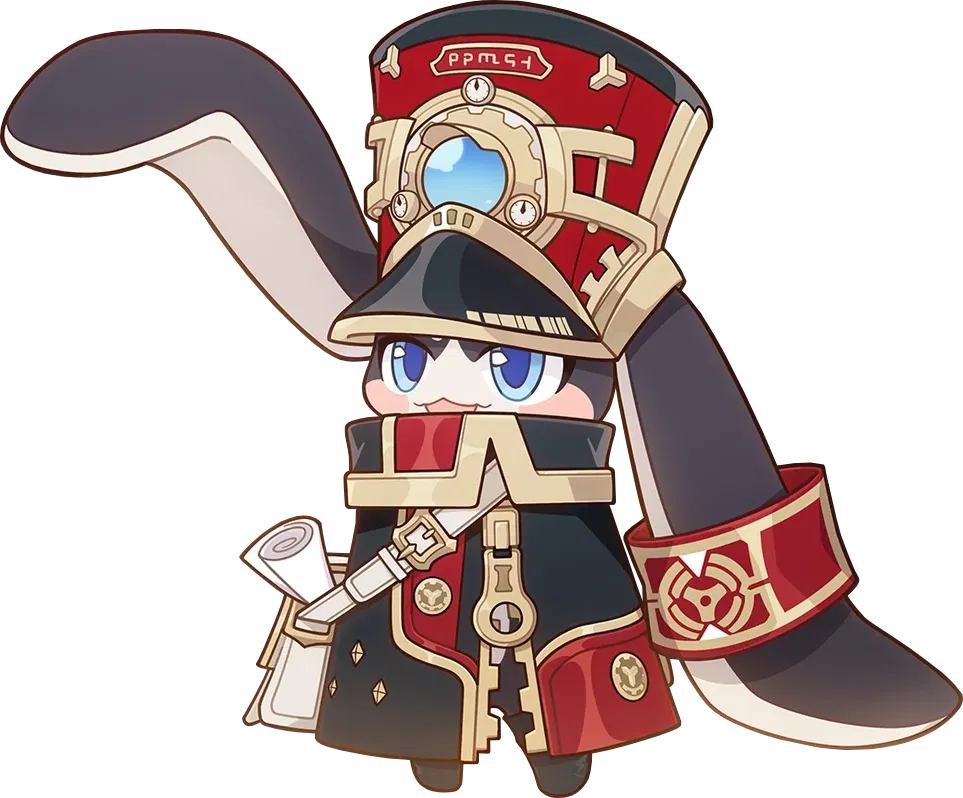
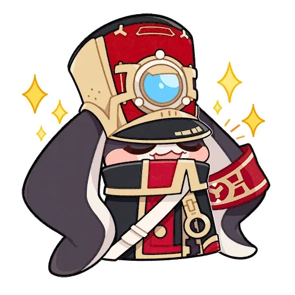

<h1 align="center">~ 👋 𝓦𝓮𝓵𝓬𝓸𝓶𝓮 𝓽𝓸 𝓶𝔂 𝓟𝓻𝓸𝓯𝓲𝓵𝓮 👋 ~ </h1>
 

## ~ About Me 💬 :

Hello, I'm Tran Thien Trung  I'm a passionate front - end developer from VietNam  and I am always willing to learn from the people around!
 

### - Hobbies 🎨 :

- ✨ Learning new things  
- ✨ Gaming  
- ✨ Watching Anime  
- ✨ Reading Light Novels, Manga  

 
 

### - Skills ( learning... ) 🛠️ :

     
    
    
    
    
    
    
     
    
    
    
    
    
     
    
     

 
 

## ~ Contact Me 📝 :

  
 If you want to reach out to me and just to hangout   or want to game together just ping me 😉.

  
  
   
   
  
  

 
 

### - Stats 📊 :

 

#### <h1 align="center">~ 𝓣𝓱𝓪𝓷𝓴𝓼 𝓯𝓸𝓻 𝓻𝓮𝓪𝓭𝓲𝓷𝓰! ~</h1>
